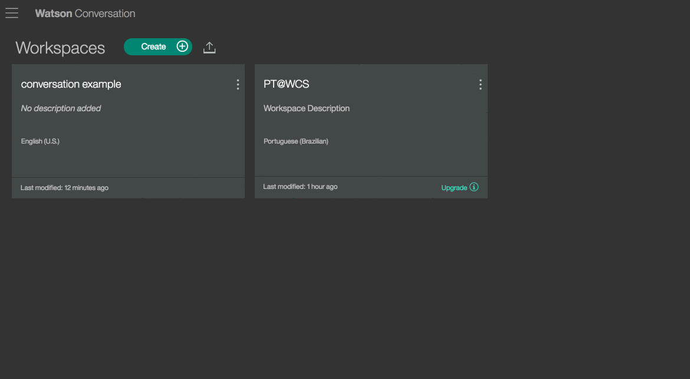
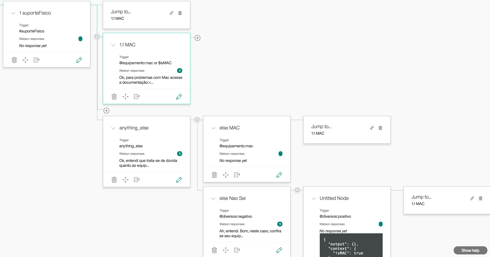
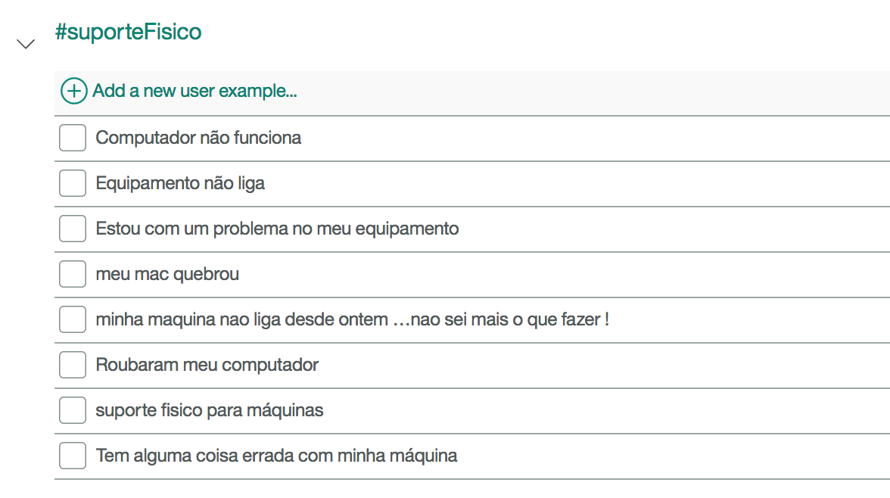
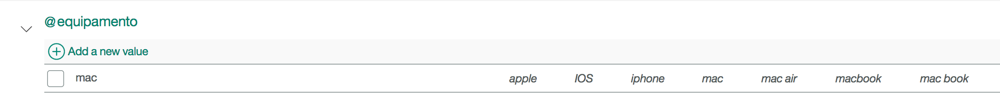

# IBM Watson Cognitive Help

#### Essa aplicação possibilita a criação rápida de um chatbot cognitivo para qualquer indústria e necessidade.

## Rodando a aplicação no localhost:

1. [Instale o Node.js](https://nodejs.org/);
2. Crie uma conta no [Bluemix](http://console.ng.bluemix.net/);
3. Crie um aplicativo [sdk for node.js](https://console.ng.bluemix.net/catalog/starters/sdk-for-nodejs?);
4. No aplicativo que foi criado, crie um novo serviço [Cloudant NoSQL DB] e [Conversation](https://console.ng.bluemix.net/catalog/services/cloudant-nosql-db);
5. Com os serviços criados e conectados ao aplicativo pegue as variáveis de ambiente e salve em um arquivo `.ENV` na raiz do código do aplicativo Exemplo de como fica o arquivo ENV. :
  
  ```
  VCAP_SERVICES = {"cloudantNoSQLDB": [{"credentials": {"username": "...username...",...
  ```
6. Na pasta do do aplicativo rode o comando `npm install`;
7. Para rodar o aplicativo rode o comando `npm start`;

Fazendo login no Bluemix
--------------------------------------------------------------------------------

Primeiro, você deve dizer ao comando `cf` qual ambiente você deseja operar
Com, com o comando `cf api`:

    cf api https://api.ng.bluemix.net

Você deve ver o seguinte resultado:

    Setting api endpoint to https://api.ng.bluemix.net...
    OK

    API endpoint: https://api.ng.bluemix.net (API version: 2.0.0)
    Not logged in. Use 'cf login' to log in.
    No org or space targeted, use 'cf target -o ORG -s SPACE'

Observe que, contanto que você nunca interaja com o ambiente Bluemix com o
Comando `cf` (e não qualquer outro ambiente CloudFoundry), você não precisará
Execute o comando `cf api` novamente.

Para fazer login no Bluemix, use o seguinte comando:

    cf login

Se for pedido o ID de utilizador da ID da IBM e a palavra-passe, tal como
exemplo:

    $ cf login
    API endpoint: https://api.ng.bluemix.net

    Username> [enter your IBM ID here]

    Password> [enter your IBM ID password here]
    Authenticating...
    OK

Você será solicitado a selecionar seu 'org' e 'espaço', basta selecionar os padrões,
Que deve ser seu IBM ID userid e `dev`, respectivamente.

When complete, you should see the following:

    API endpoint: https://api.ng.bluemix.net (API version: 2.0.0)
    User:         [your IBM ID]
    Org:          [your IBM ID]
    Space:        dev


Subindo a aplicação no Bluemix
--------------------------------------------------------------------------------

Você pode implantar um aplicativo no Bluemix com o comando `cf push`.

Use o comando a seguir para que o aplicativo seja implantado no Bluemix:

    cf push

`cf push` irá ler o arquivo de manifesto padrão` manifest.yml` para alguns
Valores padrão das opções relacionadas ao seu aplicativo e seguir com o deploy no Bluemix.

Para obter mais informações sobre os conceitos básicos de deploy de aplicativos, consulte os documentos do Cloud Foundry:

* *[Prepare to Deploy an Application](http://docs.cloudfoundry.org/devguide/deploy-apps/prepare-to-deploy.html)*
* *[Deploy Applications](http://docs.cloudfoundry.org/devguide/deploy-apps/)*

## Documentação:

> Esta aplicação contém a parte Front e Back end no mesmo pacote. Os fontes relacionados à parte FE encontram-se em ./public. 
>
> Toda interação entre o Front End e o Back End ocorre através de chamadas de APIs. Estas podem ser acessadas pela documentação quando a mesma estiver rodando: APLICACAO_URL/api-docs


### Fluxo do Conversation API interagindo com a aplicação

1. Inicialmente é necessário efetuar o setup do Conversation. Você pode utilizar o workspace default que disponibilizamos: [workspace.json](./json/workspace-basic.json) 
Abra o dashboard do Conversation e Importe o arquivo para criar a sua workspace.

2. 

3. Logo após criar sua workspace, selecione a mesma e veja em details o valor do Workspace ID

4. Adcione o Workspace ID dentro do arquivo [Conversation](./routes/conversation/ConversationCredentials.js) dentro do atributo "pt":
```json
      module.exports = {
        "creds": {
            "username": JSON.parse(process.env.VCAP_SERVICES)["conversation"][0].credentials.username,
            "password": JSON.parse(process.env.VCAP_SERVICES)["conversation"][0].credentials.password,
            "version": "v1",
            "version_date": "2017-02-03"
        },
        "pt": {
            "workspace_id": "xxxxxxx-xxxxx-xxxxxx-xxxxxx"
        },
```

5. Conforme o Workspace padrão criado no ítem 1, você deverá sempre possuir diálogos para cada uma de suas intenções e entidades conforme seu modelo e fluxo de conversa.
  
    Para melhor ilustrar, verifique um fluxo básico abaixo:
     

     1. Por exemplo para um fluxo respostas sobre Suporte físico, foi criado um primeiro Node __1 Suporte Físico__ que é inicializado com a intenção __#suporteFisico__:
     
     Ou seja, caso venha alguma pergunta parecida com estas da intenção, o primeiro fluxo será inicializado
     2. Caso na pergunta tenha algo muito específico que remeta à um problema com __MAC__, o fluxo __1.1 MAC__ seria iniciado. Mas para isso, veja a trigger __@equipamento:mac__ . Ela que vai identificar se há algo no texto que remeta à Entidade __@equipamento:mac__ conforme os sinônimos da mesma:
     
     
     > __Importante - Fluxo final__ : No caso de uma pergunta específica à MAC, se este for o fluxo FINAL, coloque uma tag conforme arquivo [chat.controller.js](./public/chat/chat.controller.js). No caso, se a tag __{{final}}__ estiver presente na mensagem do Conversation, o aplicativo vai exibir as opções de solicitação de Feedback ao usuário pois entenderá que é o fim da conversa:
     
     ```json
        ChatService.askWatson(inputText, null, props.currentContext.genesys).then(function (data) {
          if (data.output) {
              if (data.output.text.length) {

                  var shouldAskFeedback = /{{final}}/.test(data.output.text[0]),
                      finalText = "";


                  if (shouldAskFeedback) {
                      $timeout(function () {
                          configs.showFeedbackDiv(true);
                      }, 200);

                      finalText = data.output.text[0].replace("{{final}}", "").trim();
     ```
     3. Caso não tenha algo relacionado à MAC, o fluxo cairá no diálogo: __anything_else__ , ou seja, é uma dúvida de equipamento mas ainda não sabe qual. No exemplo é perguntado se a máquina é prata (remetendo ao MAC) e verifica se a resposta tem relação com a entidade __@diversos:positivo__  que identifica respostas positiva.
    
        A mesma sendo positiva, o fluxo é enviado ou __Jump To__ de volta ao node 1.1, porém antes é adcionado uma variável local que diz que alguém respondeu `sim` para uma pergunta do tipo: `seu equipamento é prata?`:
        ```json
          {
            "context": {
              "isMAC": true
            },
            "output": {}
          }
        ```
        E ao retornar ao node 1.1, existe também a verificação em __TRIGGER__: `or $isMAC`, fechando então o fluxo para dúvidas de equipamento do tipo MAC.


 

## Estrutura do projeto

./config  - Classes com propriedades de conexão aos serviços e outras configurações básicas

./docs    - Arquivos utilizados nas documentações

./js      - Implementação de funções do Cloudant e outros diversos

./json    - Workspace de IT Padrão do WatsonConversation API

./public  - Arquivos relacionados ao módulo web/mobile

./public/chat/chat.controller.js - Controladora do chat responsável pela geração e fluxo dos componentes do chat na tela

./public/chat/chat.factory.js - Service Angular dos requests utilizados no chat

./routes/partials - Diversos handlers de interação com serviços 


## Extras
Após a edição de alguns arquivos de temas como: .public/themes-disclaimer/Themes.dataset.json , atualize as bibliotecas e css minimificadas:

`gulp browserify-themes`
